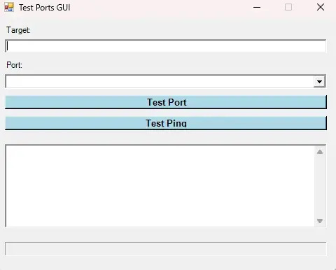

# CheckPortGUI.ps1 — Simple Port Tester 

Small PowerShell GUI to test **common ports** and **ICMP ping** against a target host. Uses `Test-NetConnection` under the hood and shows a per-port status with a progress bar.



## Requirements
- Windows PowerShell 5.1 (x64 recommended)
- Network access to the target

## Included checks
Dropdown protocols mapped to port sets:
- FTP (20, 21, 22, 989, 990)
- HTTP (80, 443)
- SMB (139, 445)
- LDAP/AD (389, 636, 3268, 3269, 464, 88, 9389, 53, 5353)
- SQL (1433)
- EPMtestCore (80, 443, 139, 445, 9593, 9594, 9595)
- EPMtestClient (139, 445, 9593, 9594, 9595, 33354, 33355, 33370, 33371, 44343)
- VNC (5800, 5900)
- Synology (5000, 5001, 21, 22, 2049, 445, 5432, 3306, 137, 138, 139, 80, 443, 873, 3260, 1194, 5353, 6690, 6881, 1900)

## Install
Save the script as `CheckPortGUI.ps1` in your working directory

## Run
```powershell
powershell.exe -NoProfile -ExecutionPolicy Bypass -File .\CheckPortGUI.ps1
```

## Usage
- Enter the target hostname or IP.
- Pick a protocol from the dropdown.
- Click “Test Port” to run all ports in that set (progress bar updates).
- Click “Test Ping” for an ICMP reachability check.
Results appear in the textbox (one line per port: Port, Status, Description).