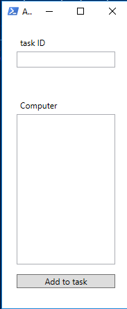
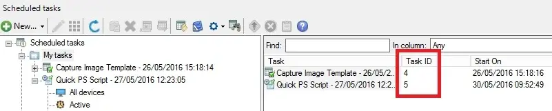

# AddToTask

**AddToTask** is a PowerShell script designed to add devices (computers) to a scheduled task in **IVANTI Endpoint Manager (EPM)**. This script features a simple graphical user interface (GUI) for entering a task ID and a list of computers.

## Features
- User-friendly GUI built with WPF.
- Quickly adds multiple machines to a scheduled task.
- Leverages a web service to interact with IVANTI Endpoint Manager.

## Usage
- use addtotask.ps1

 

- In “Task ID”, add your task ID

 

- In “Computer”, add the computers to be added to the task