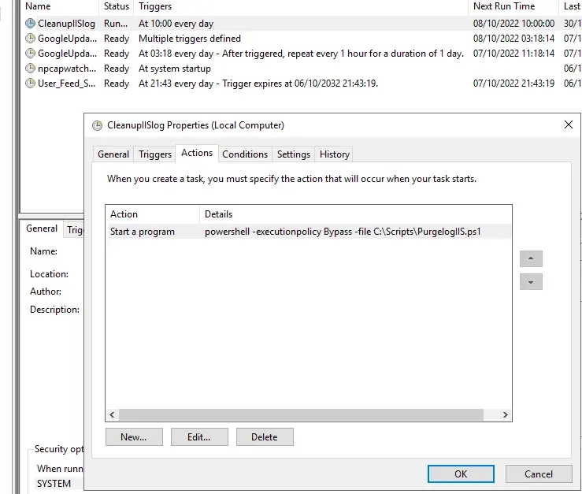

# Purge IIS Logs (PowerShell)

Purge old IIS log files to prevent the C: drive from filling up (IIS logs are stored by default under `%SystemDrive%\inetpub\logs\LogFiles`). :contentReference[oaicite:0]{index=0}


## Usage

Adjust $LogPath, $maxDaystoKeep, and $outputPath as needed.

Run from an elevated PowerShell prompt on the IIS server.

## Schedule (Task Scheduler)


Run weekly as SYSTEM (example: Sundays 02:00):
```powershell
schtasks /Create /TN "IIS Logs Purge" ^
  /TR "powershell.exe -NoProfile -ExecutionPolicy Bypass -File C:\Scripts\Purge-IISLogs.ps1" ^
  /SC WEEKLY /D SUN /ST 02:00 /RU SYSTEM /RL HIGHEST /F
```