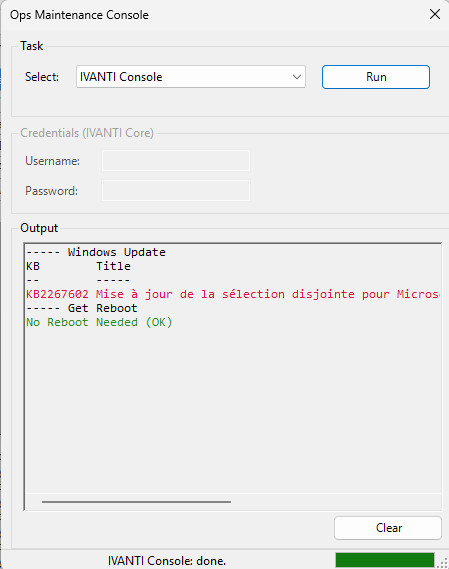

# ExploitBox

## PowerShell GUI for Maintenance Tasks (Ivanti / WSUS)

This project provides a PowerShell-based GUI tool to assist with routine maintenance operations, specifically targeting Ivanti and WSUS environments.

---

## 🔧 Configuration

Edit the following variables at the top of the `ExploitBox.ps1` script:

```powershell
# ==== Global Config ====
$script:IvantiSqlInstance = "serveurIVANTI.domain.lan"
$script:IvantiSqlDatabase = "LDMS123"
```

---

## 📦 Installation

Before running the script, install the required PowerShell modules:

```powershell
Install-Module SqlServer -Scope CurrentUser -Force
Install-Module PSWindowsUpdate -Scope CurrentUser -Force -AllowClobber
```

---

## ▶️ Execution

Unblock the script and execute it using PowerShell:

```powershell
Unblock-File .\ExploitBox.ps1
powershell.exe -NoProfile -ExecutionPolicy Bypass -File .\ExploitBox.ps1
```

---

## 💡 Features

- GUI interface for easier operations  
- Connects to Ivanti SQL database  
- Uses `PSWindowsUpdate` for patch management  
- Modular and easily configurable  

---

## 📸 Screenshots



---

