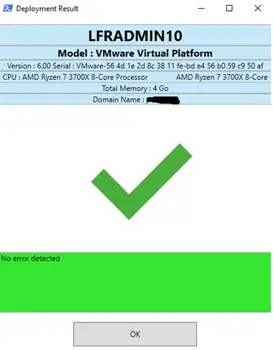
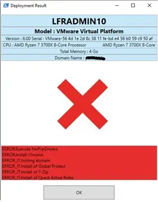
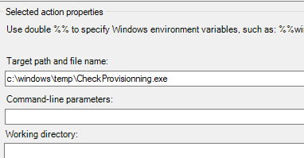

# Ivanti EPM — Check Provisioning (Error Summary)

Display a concise summary of **errors encountered at the end of an Ivanti EPM provisioning**. Add this step at the tail of your provisioning template to quickly spot failed actions before handing off the device.





## What it does
- Parses the provisioning history and surfaces **failed steps** so you can fix issues immediately.
- Intended to run **as the last step** of an EPM provisioning task (post-install checks).

## Requirements
- Ivanti EPM environment with a provisioning template.
- PowerShell 5.1+ on the target device.
- Local admin context during provisioning (standard for EPM provisioning steps).

## Installation
1. Download the script (place it alongside your provisioning resources).
2. In the **Ivanti EPM Console**, open your provisioning template.
3. Add a final action that runs PowerShell and points to the script.
4. Save and redeploy the template.

## Usage
### In a provisioning template (recommended)
- Action type: **PowerShell** (or **Execute File** → powershell.exe).
- Command:
  ```bat
  powershell.exe -NoProfile -ExecutionPolicy Bypass -File .\CheckProvisioning.ps1
  ```
  